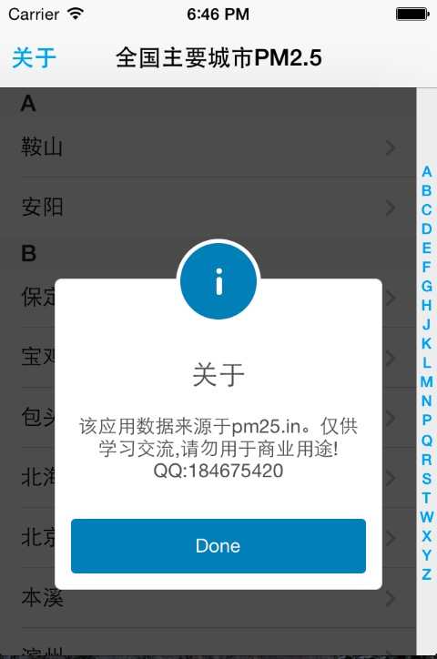
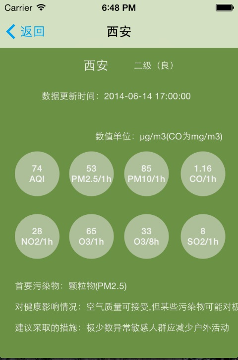

# Swift-PM25


一个基于Swift实现的PM2.5查询示例。基于```CocoaPods```构建。克隆后切换到```Swift-PM25```目录下，使用```pod install```安装依赖库。然后启动```PM25.xcworkspace```


# Screenshots







# 用到的开源类库


* [TFHpple](https://github.com/topfunky/hpple) XPath解析HTML

* [SCLAlertView](https://github.com/vikmeup/SCLAlertView-Swift) 用Swift写的AlertView

* [SVProgressHUD](https://github.com/samvermette/SVProgressHUD) 进度条


# License

MIT

Copyright (c) 2014 雪山飞鹄