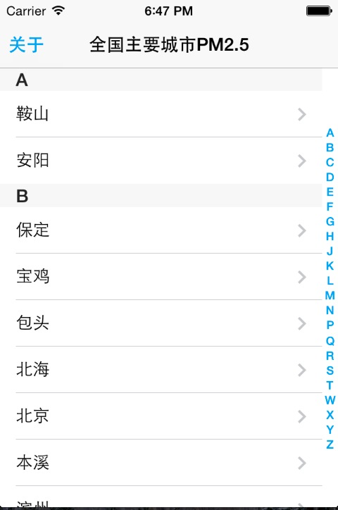

Swift-PM25
==========


一个基于Swift实现的PM2.5查询示例。基于```CocoaPods```构建。克隆后使用```pod install```安装所需类库。然后启动```PM25.xcworkspace```


# 用到的开源类库

* [TFHpple](https://github.com/topfunky/hpple) 以XPath方式解析HTML

* [SCLAlertView](https://github.com/vikmeup/SCLAlertView-Swift) 使用Swift写的AlertView

* [SVProgressHUD](https://github.com/samvermette/SVProgressHUD) 加载进度条





# 与我联系

QQ:184675420

Mail:sxyx2008@163.com

Weibo:[http://weibo.com/qq184675420](http://weibo.com/qq184675420)

WebSite:[aimeizi.net](http://aimeizi.net)

GitHub:[https://github.com/sxyx2008](https://github.com/sxyx2008)


# License

MIT

Copyright (c) 2014 雪山飞鹄